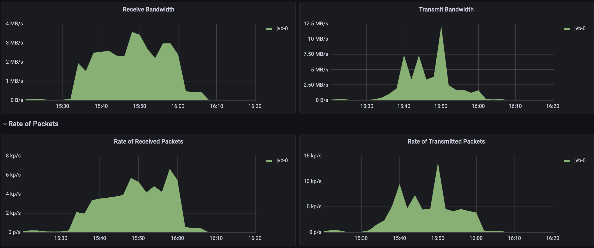

# Load test n°1, 2022/02/23

## Context 

This test aims at knowing if the newly deployed cluster holds little load,
especially the JVB node.

---

## Description of the infrastucture

We are using the infrastructure deployed by [jitsi-k8s repository](https://github.com/openfun/jitsi-k8s/tree/59bdc9c799db3f0decedbb4b6f870f246091d7c8)

There is only one JVB node, running on a XS kubernetes node of scaleway.

---

## Approach

We asked for approximatively 10 friends to come and activate their camera and microphone
in the same meeting.

As an additionnal load, we strarted 15 internet browser tabs on 2 laptops which were
receiving audio and video.

The test began at 3:30 PM (UTC) and stopped at 4:00 PM (UTC).

Hours of graphs are in UTC.

---

## Results

### Observations

Approximatively 5 videos were received by clients at the same time, and
according to internet browsers, clients were trying to save bandwidth by
disabling the reception of some video stream.

### Metrics taken from the grafana dashboard

---

## Interpretation of results

As client browsers were trying to save bandwidth, the bottleneck of this
test was probably the client bandwidth, we will focus on cloud-based
solutions for load testing.

The fact that the memory usage on the JVB does not fall after the end of every
conferences is quite worrying, it could reflect a memory leak. Further
investigations are needed.
